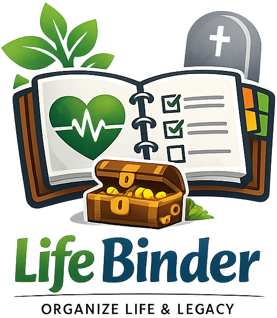

  

# Life Binder

A local-first, encrypted end-of-life planning and information management application. Life Binder helps you organize critical information and create an actionable runbook for your loved ones.

- _Ideal self-hosted tool for your NAS. Checkout [DEPLYOMENT.md](./DEPLOYMENT.md) for more info_
- _Available as a ready to use Docker image at https://hub.docker.com/r/w0rldart/lifebinder_

## What is Life Binder?

Life Binder combines two essential components:

1. **Information Vault**: A structured repository for personal information
   - Personal info
   - Document locations
   - Account details
   - Emergency plans

2. **Actionable Runbook**: A crisis-ready guide for trusted contacts
   - First 24 hours checklist
   - Priority notification order
   - Access instructions
   - Critical account information

### What Life Binder Does NOT Do

- No cloud sync or multi-device support
- No user authentication or accounts (single-user application per deployment)
- No server-side data storage (all data stored client-side in browser IndexedDB)
- No integration with external services
- No automated asset valuation or financial calculations

### Inspiration & Resources

Life Binder draws inspiration from two key resources:

- **Erik Dewey's "Big Book of Everything"** - A comprehensive personal information management framework
- **[potatoqualitee/eol-dr](https://github.com/potatoqualitee/eol-dr)** - An end-of-life digital readiness checklist that provided valuable insights for features including tech infrastructure management, social media disposition planning, residual income tracking, cryptocurrency holdings, physical security documentation, and account recovery information

## Features

### Core Sections

- **Dashboard**: Overview, completeness tracking, and First 24 Hours preview
- **Contacts**: Emergency contacts with priority notification ordering
- **Access**: Email accounts, password manager location, 2FA recovery, device retention, network infrastructure, IoT devices
- **Accounts**: Subscriptions, cloud services, domains, hosting accounts, social media accounts
- **Documents**: Document locations with sensitivity levels
- **Physical Security**: Safes, file cabinets, security systems, and keys
- **Security Recovery**: Account recovery security questions and answers
- **Emergency**: Meeting locations, utility shutoffs, emergency contacts, grab list
- **Will & Testaments**: Estate planning, executors, assets, beneficiaries, funeral preferences
- **Financial**: Bank accounts, investments, retirement accounts, insurance, debts, financial advisors, accountants, residual income, cryptocurrency
- **Notes**: Personal notes with categories, colors, and pinning
- **Export**: PDF generation and encrypted backup import/export
- **Help & Guide**: Comprehensive searchable documentation and FAQ
- **Settings**: Encryption management, auto-lock configuration, and plan management

### Key Capabilities

- ✅ Passphrase-protected encryption
- ✅ Auto-lock after inactivity
- ✅ Contact priority ordering (up/down buttons)
- ✅ High-sensitivity document exclusion from PDF exports
- ✅ Encrypted JSON backup/restore
- ✅ Professional PDF runbook generation
- ✅ Security warnings for sensitive data
- ✅ Completeness tracking
- ✅ Last updated timestamps
- ✅ Searchable help documentation
- ✅ Plan reset/deletion
- ✅ Demo data for exploration

### PDF Exports

PDF exports include:
- First 24 Hours action checklist
- Priority contacts to notify before social announcements
- Access information and password manager location
- Critical accounts with billing warnings
- Document locations (high-sensitivity excluded by default)
- Emergency plan and contacts

### Privacy & Security

**Your data never leaves your device.**

- **Local-First**: All data stored in your browser's IndexedDB
- **Encrypted at Rest**: AES-GCM encryption with passphrase-derived keys (PBKDF2)
- **No Backend**: No servers, no accounts, no data collection
- **Auto-Lock**: Automatic session lock after 10 minutes of inactivity
- **Export Options**:
  - Encrypted JSON backups for secure storage
  - PDF exports for sharing with trusted individuals

## Usage

### Creating Your Binder

1. **Set Up Contacts**: Add emergency contacts and set notification priority
2. **Document Access**: Note where passwords and important accounts are located
3. **Track Accounts**: List subscriptions, cloud services, domains
4. **Catalog Documents**: Record locations of important papers
5. **Emergency Plan**: Set meeting locations, utility shutoffs, grab list
6. **Export**: Generate PDF and encrypted backups

### Security Best Practices

- **Passphrase**: Use a strong, unique passphrase
- **Backups**: Export encrypted backups regularly
- **Storage**: Store backups in multiple secure locations
- **Updates**: Review and update information after major life changes
- **Sharing**: Share PDF exports only with trusted individuals
- **Avoid**: Don't store raw passwords or PINs; note their locations instead

## Data Persistence and Backups

### How Data is Stored

Life Binder uses a **local-first architecture**:
- All data is stored in your browser's IndexedDB (client-side storage)
- No server-side database or data collection
- Data remains on the device where you use Life Binder
- Each browser/device maintains its own separate data

### Backup Strategies

1. Regularly export encrypted backups using the Export feature
2. Store backups in multiple secure locations (encrypted USB drives, secure cloud storage)
3. Consider printing critical information and storing in a safe

### Multi-Device Access

To access your Life Binder data on multiple devices:
1. Export encrypted backup from Device A
2. Access Life Binder on Device B
3. Import the encrypted backup on Device B
4. Remember to periodically sync by exporting/importing

## Security Notice

⚠️ **Your passphrase cannot be recovered if lost.** Store it securely and share with trusted individuals who may need emergency access.

⚠️ **Browser data can be cleared.** Always maintain encrypted backups in multiple secure locations.

⚠️ **Self-hosting security:** When hosting Life Binder on a network-accessible server, use HTTPS with valid certificates to protect data in transit. Consider access restrictions (VPN, firewall rules) for sensitive deployments.

## Contributing

Contributions are welcome! Please ensure:

1. Checkout [DEPLYOMENT.md](./DEPLOYMENT.md)
1. Code follows existing patterns
1. TypeScript types are properly defined
1. Security best practices are maintained
1. Documentation is updated
1. Testing is performed

## Support & Donations

Life Binder is an open-source project under the MIT License (see [LICENSE](./LICENSE) for details).
If you find it useful, consider supporting its development:

### Ways to Support

- **[GitHub Sponsors](https://github.com/sponsors/w0rldart)** - Sponsor me on GitHub
- **[Star on GitHub](https://github.com/w0rldart/lifebinder)** - Help others discover the project
- **Contribute** - Submit issues, feature requests, or pull requests

Your support helps maintain and improve Life Binder for everyone. Thank you!
